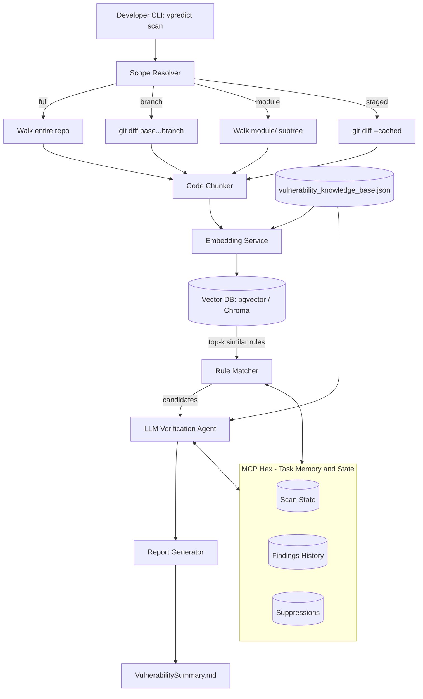

# Vulnerability Prediction Orchestrator — Design Spec

Reads: `vulnerability_knowledge_base.json` (the rule/CWE corpus)
Writes: `VulnerabilitySummary.md` (the per-run report)
State: MCP **Hex** server (cross-run memory)

This document describes how a local CLI tool ties the JSON rule corpus to an LLM so a developer can scan a repo (full project, a branch's diff, or a single module) and get back a Markdown report that points at the exact vulnerable code block, the matching CWE, and a concrete fix.

---

## 1. Purpose

Today the rule corpus (`vulnerability_knowledge_base.json`) is just data. This spec defines the **orchestrator** that:

1. Decides *what code* to look at (whole repo / branch diff / one module / staged changes).
2. Chunks that code and finds *candidate* matches against the rule corpus via semantic similarity (not just regex).
3. Sends each candidate chunk + matched rule(s) to an LLM for **verification and fix drafting** (reduces false positives from pure embedding similarity).
4. Persists scan state in **Hex** so repeat scans are incremental and don't re-flag things a developer already dismissed or fixed.
5. Emits `VulnerabilitySummary.md` — a human-readable report a developer reads in their terminal, IDE, or PR.

---

## 2. High-Level Architecture



---

## 3. Core Components

### 3.1 CLI Entry Point
A Picocli-based Java CLI (consistent with the existing AVIT tooling), exposed as `vpredict`, callable directly or from a Git hook / IDE.

### 3.2 Scope Resolver
Translates a CLI flag into a concrete file set:

| Flag | Resolves to |
|---|---|
| `--full` | every source file in the repo (excluding build/test fixtures) |
| `--branch <name>` | `git diff <base>...<name>` — only files touched on that branch |
| `--module <path>` | every file under that module/subtree |
| `--staged` | `git diff --cached` — what's about to be committed (pre-push hook use case) |
| `--since <ref>` | `git diff <ref>...HEAD` — e.g. `--since HEAD~5` |

Default scope when no flag is given: `--staged`, falling back to the diff against the branch's merge-base with `main` — this is what makes the tool cheap enough to run on every push.

### 3.3 Code Chunker
Splits each resolved file into method/function-sized chunks (using language-aware parsing, e.g. JavaParser for `.java`) rather than raw line windows, so a finding can point at a coherent code block instead of an arbitrary slice.

### 3.4 Embedding + Rule Matching
- Each chunk and each rule's `detection_signals` / `description` / `vulnerable_pattern` fields are embedded (CodeBERT or an OpenAI/Claude embedding model).
- Chunk embeddings are matched against the rule corpus embeddings in pgvector/Chroma; top-k matches above a similarity threshold become **candidates**.
- This stage is intentionally high-recall / low-precision — it's a cheap pre-filter, not the final verdict.

### 3.5 LLM Verification Agent
For each candidate (chunk + matched rule JSON object), the LLM is asked to:
1. Confirm or reject the match (the embedding stage produces false positives — e.g. a `Pattern.matches` call that isn't actually fed by user input).
2. If confirmed, extract the **exact vulnerable line range**.
3. Draft a **remediation** — both the explanation and a corrected code snippet — grounded in the rule's `secure_pattern` and `recommended_fix` fields.
4. Assign a confidence level and reuse the rule's `severity`/`automatable_fix` metadata.

This is the same role Claude/GPT-4o plays in the existing AVIT Fix Agent — this orchestrator generalizes that pattern to general CWE prediction instead of only AVIT-ticket matching.

### 3.6 MCP Hex — Task Memory & State
Hex is queried/updated at two points:

- **Before scanning**: fetch `last_scanned_commit_sha` for this repo+scope, and the list of `suppressed_finding_ids` (developer-dismissed false positives) and `fixed_finding_ids`, so the matcher doesn't re-surface them.
- **After scanning**: write the new findings, update `last_scanned_commit_sha`, and append to findings history (so trend reporting — e.g. "this module's vulnerability count over time" — is possible).

See §6 for the schema.

### 3.7 Report Generator
Renders the LLM's verified findings into `VulnerabilitySummary.md` using a fixed template (see §8) so the report is the same shape every run — predictable for both a developer and any downstream tool (e.g. Copilot reading it back in as context).

---

## 4. End-to-End Flow

1. Developer runs `vpredict scan --module payment-service` (or it fires automatically from a pre-push hook / IDE action).
2. CLI calls **Hex** → `get_scan_state(repo, scope)` → gets `last_scanned_commit_sha` + suppression list.
3. Scope Resolver determines the file set (new/modified files since `last_scanned_commit_sha`, or the full module if first run).
4. Code Chunker splits changed files into chunks.
5. Each chunk is embedded and matched against `vulnerability_knowledge_base.json` rule embeddings → candidate (chunk, rule) pairs.
6. Candidates already in the suppression list are filtered out before hitting the LLM (saves tokens, respects developer overrides).
7. Remaining candidates go to the LLM Verification Agent, one rule-grounded prompt per candidate (or batched where context allows).
8. Confirmed findings are written back to **Hex** (`record_findings`) and the summary file is generated.
9. CLI prints a one-line console summary and the path to `VulnerabilitySummary.md`; exit code reflects whether any `Critical`/`High` findings exist (useful for CI gating later).

---

## 5. CLI Usage

```bash
# Scan only what's staged for commit (fast path, used by the pre-push hook)
vpredict scan --staged

# Scan everything changed on a feature branch vs. main
vpredict scan --branch feature/payment-refactor

# Scan a specific module regardless of git state
vpredict scan --module payment-service

# Scan everything changed in the last 5 commits
vpredict scan --since HEAD~5

# Full-repo baseline scan (e.g. run weekly, or once when onboarding the tool)
vpredict scan --full

# Common flags
vpredict scan --module payment-service \
  --output VulnerabilitySummary.md \
  --min-severity Medium \
  --rules ./vulnerability_knowledge_base.json \
  --no-llm-verify        # embedding-only, faster, noisier — for quick local iteration
```

Exit codes: `0` = no findings ≥ `--min-severity`; `1` = findings present; `2` = scan error. This lets it slot into a pre-push hook (`--staged`, block the push) without any CI changes.

---

## 6. MCP Hex State Schema

Hex is called as an MCP server (`hex.*` tools) and is the only thing that makes scans **incremental** and **idempotent** across IDE, CLI, and pre-push invocations.

```json
{
  "scan_state": {
    "repo": "org/payments-platform",
    "scope_key": "module:payment-service",
    "last_scanned_commit_sha": "a1b2c3d",
    "rule_corpus_version": "1.0",
    "updated_at": "2026-06-19T10:15:00Z"
  },
  "findings": [
    {
      "finding_id": "f-7f3a1c",
      "cwe_id": "CWE-89",
      "file": "src/main/java/.../PaymentController.java",
      "line_range": [142, 145],
      "first_seen_commit": "a1b2c3d",
      "status": "open",
      "confidence": "high"
    }
  ],
  "suppressions": [
    {
      "finding_id": "f-2b9e44",
      "reason": "false positive - input is server-generated, not user input",
      "suppressed_by": "himanshu.sharma",
      "suppressed_at": "2026-06-10T09:00:00Z"
    }
  ]
}
```

Hex tool calls used by the orchestrator:
- `hex.get_scan_state(repo, scope_key)` → returns the block above for that scope.
- `hex.save_scan_state(repo, scope_key, last_scanned_commit_sha)`
- `hex.record_findings(repo, scope_key, findings[])`
- `hex.list_suppressions(repo, scope_key)`
- `hex.suppress_finding(finding_id, reason, user)` — called when a developer marks something a false positive in the IDE/report, so it never resurfaces.
- `hex.mark_fixed(finding_id, fix_commit_sha)` — called once a finding's code is no longer present in a later scan, or explicitly by the auto-patch agent (future work, §10).

---

## 7. IDE / Copilot Integration

- **VS Code / IntelliJ**: a thin extension shells out to `vpredict scan --staged --output VulnerabilitySummary.md`, then renders the findings as inline diagnostics/squiggles (mapping `file` + `line_range` from each finding) and surfaces `VulnerabilitySummary.md` in a side panel. The Hex suppression call is wired to a "Mark as false positive" code action.
- **GitHub Copilot**: the rule corpus + the generated `VulnerabilitySummary.md` are exposed as additional context (e.g. via a Copilot chat participant or workspace context file) so a developer can ask Copilot "fix CWE-89 in PaymentController" and Copilot has the exact finding, vulnerable block, and the rule's `recommended_fix` already available rather than re-discovering it.
- **Pre-push git hook**: calls `vpredict scan --staged`; a non-zero exit (Critical/High found) blocks the push and points the developer at `VulnerabilitySummary.md`, mirroring the existing AVIT pre-push hook pattern.

---

## 8. `VulnerabilitySummary.md` Output Spec

Each run produces one file with this shape (see the companion example file for a fully populated sample):

```
# Vulnerability Summary
(scan metadata: repo, scope, commit range, timestamp, rule corpus version, totals by severity)

## Finding <n>: <CWE-ID> — <name>
- Severity / Confidence / OWASP 2025 category / Status (New | Recurring | Suppressed)
- File: <path>:<line-range>
### Vulnerable code
(exact code block)
### Why this is a risk
(2-3 sentences, grounded in the rule's description)
### Recommended fix
(corrected code block + explanation, grounded in the rule's secure_pattern/recommended_fix)
- Automatable: yes/no
```

The report is intentionally one Markdown file (not split per finding) so it's easy to attach to a PR description or paste into a Copilot/Claude chat as context.

---

## 9. Developer Workflow (Day to Day)

1. Developer writes code, stages changes.
2. Pre-push hook (or a manual `vpredict scan --staged`) runs automatically — takes seconds because it's scoped to the diff and uses Hex's incremental state.
3. If findings appear, `VulnerabilitySummary.md` opens (or the IDE panel highlights them) — developer reads the exact block + fix.
4. Developer either applies the suggested fix (for `automatable_fix: true` items, optionally one-click via the IDE extension), asks Copilot/Claude to apply it using the finding as context, or marks it suppressed with a reason if it's a false positive.
5. On the next push, Hex already knows what was suppressed/fixed, so only genuinely new code is re-evaluated.
6. Periodically (weekly, or before a release), someone runs `vpredict scan --full` as a baseline sweep across the whole repo, independent of the incremental diff-based runs.

---

## 10. Future Extensions

- **Auto-patch agent**: for `automatable_fix: true` findings, generate the fix as a separate commit/PR automatically (the next phase already planned for the AVIT tool), with Hex tracking `proposed → applied → verified` status per finding.
- **CI gating**: reuse the same exit-code contract in a pipeline stage, not just the local pre-push hook.
- **Trend reporting**: Hex's findings history enables a "vulnerability density over time per module" view, useful for prioritizing refactors.
- **Rule corpus feedback loop**: suppressed findings with a stated reason get periodically reviewed to refine `detection_signals` in `vulnerability_knowledge_base.json`, reducing future false-positive rates.
