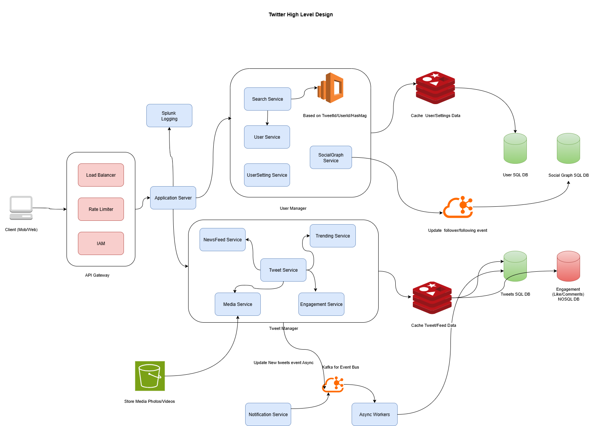

# Twitter – High Level Design (HLD)

This repository contains the **High Level Design (HLD) of a Twitter-like system**, focusing on scalability, availability, and low-latency feed generation.  
The design follows **real-world distributed system principles** and is suitable for **system design interviews**.

## Architecture Diagram

---

## Requirements

### Functional
- User registration & authentication
- Post tweets (text/media)
- Follow / unfollow users
- Like, reply, retweet tweets
- Home timeline (news feed)
- Search tweets and users
- Notifications
- Trending topics

### Non-Functional
- Low latency (<200ms for feed)
- High availability
- Horizontally scalable
- Eventual consistency
- Read-heavy workload

---

## High Level Architecture

Client (Web/Mobile)
↓
API Gateway (Load Balancer, Rate Limiter, IAM)
↓
Application Server
↓
Domain Microservices
↓
Cache / Databases / Event Bus

---

## Core Services

- **User Service**  
  Manages user profiles and account data (SQL DB).

- **User Settings Service**  
  Stores privacy and preference settings (Redis + SQL).

- **Social Graph Service**  
  Handles follow/unfollow and follower relationships using a directed graph model (NoSQL).

- **Tweet Service**  
  Creates and stores tweet metadata (NoSQL – Cassandra/DynamoDB).

- **Media Service**  
  Manages image/video uploads using object storage (S3/GCS).

- **Engagement Service**  
  Handles likes, replies, retweets, and counters (NoSQL + Redis).

- **NewsFeed (Timeline) Service**  
  Generates the home feed using a hybrid fan-out strategy (Redis + NoSQL).

- **Search Service**  
  Enables tweet and user search using Elasticsearch (secondary index).

- **Trending Service**  
  Computes trending topics using stream processing over events.

- **Notification Service**  
  Sends real-time and async notifications for user activities.

---

## Asynchronous Processing

- **Kafka** is used as the event bus for:
  - Tweet creation
  - Follow/unfollow events
  - Engagement events
  - Search indexing
  - Notifications
  - Analytics

This ensures loose coupling and high scalability.

---

## Caching Strategy
- Redis is used for:
  - Home timelines
  - User settings
  - Tweet and engagement counters
- Read-through and TTL-based eviction patterns are applied.

---

## Data Storage Summary

| Data | Storage |
|----|----|
| User Profiles | SQL |
| Tweets | NoSQL |
| Engagements | NoSQL |
| Social Graph | NoSQL |
| Timelines | Redis + NoSQL |
| Search Index | Elasticsearch |
| Media | Object Storage |

---

## Key Design Decisions
- NoSQL databases for high write throughput
- Redis for low-latency feed access
- Kafka for asynchronous fan-out and decoupling
- Elasticsearch used only for search (not source of truth)
- Eventual consistency to improve availability

---

## Diagram Reference

The complete system architecture is illustrated in  
📎 **`twitter01.drawio.png`**

This diagram shows service boundaries, data stores, caches, and async event flows.

---
